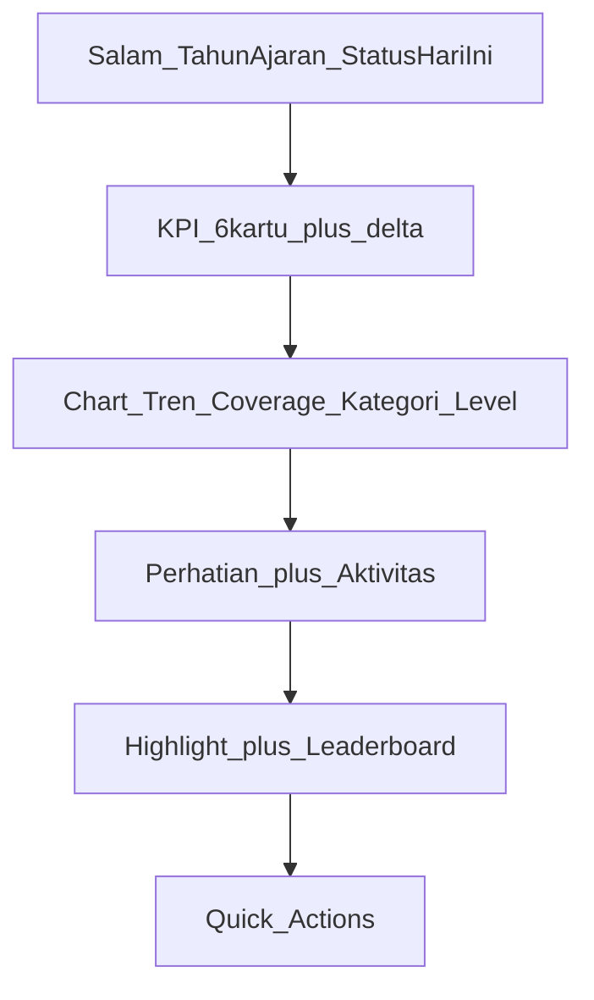

# Admin Dashboard Command Center Implementation Plan

> **For agentic workers:** REQUIRED SUB-SKILL: Use superpowers:subagent-driven-development (recommended) or superpowers:executing-plans to implement this plan task-by-task. Steps use checkbox (`- [ ]`) syntax for tracking.

**Goal:** Mengubah dashboard admin menjadi command center reputasi & kendali prestasi sekolah (bukan halaman CRUD kosong).

**Architecture:** Agregasi sekolah-wide di service khusus, view Blade diperluas mengikuti bahasa visual navy/gold yang ada, Chart.js di-reuse seperti dashboard guru. Admin **tidak** mengambil alih verifikasi (tetap job guru).

**Tech Stack:** Laravel Blade, Chart.js 4 (sudah di `package.json`), Vite, feature tests dengan `RefreshDatabase`.

**Out of scope (sengaja):** export PDF/Excel laporan bulanan, notifikasi database ke admin, redesign sidebar.

## Global Constraints

- Pertahankan layout [`resources/views/layouts/desktop.blade.php`](../../../resources/views/layouts/desktop.blade.php) dan palet navy/gold (`#232168`, `#d9a441`)
- Ikuti pola data + canvas dari [`resources/views/guru/dashboard.blade.php`](../../../resources/views/guru/dashboard.blade.php) + [`resources/js/guru-dashboard-charts.js`](../../../resources/js/guru-dashboard-charts.js)
- Query scope = **seluruh sekolah** (bukan kelas binaan)
- Copy UI bahasa Indonesia, ringkas, actionable

---

## Layout Target

## File Map

| File | Role |
|------|------|
| [`app/Services/AdminDashboardStats.php`](../../../app/Services/AdminDashboardStats.php) | **BARU** — semua agregasi KPI/chart/feed/leaderboard |
| [`app/Http/Controllers/Admin/DashboardController.php`](../../../app/Http/Controllers/Admin/DashboardController.php) | Panggil service, kirim ke view |
| [`resources/views/admin/dashboard.blade.php`](../../../resources/views/admin/dashboard.blade.php) | Layout command center |
| [`resources/js/admin-dashboard-charts.js`](../../../resources/js/admin-dashboard-charts.js) | **BARU** — line + doughnut + bar charts |
| [`vite.config.js`](../../../vite.config.js) | Daftarkan entry JS baru |
| [`tests/Feature/AdminDashboardTest.php`](../../../tests/Feature/AdminDashboardTest.php) | **BARU** — assert KPI, coverage, pending aging |

## Data Contract (`AdminDashboardStats::build()`)

Kembalikan array:

- **header:** `greeting`, `date_label`, `pending_today` (count pending)
- **kpis:** `total_achievements`, `pending`, `approved_this_month`, `total_students`, `total_classes`, `coverage_pct` — masing-masing punya `value` + `delta` (selisih vs bulan kalender sebelumnya; coverage vs bulan lalu berdasarkan siswa dengan approved di bulan itu)
- **attention:** list max 5 item `{label, count, hint}`:
  - pending > 3 hari
  - kelas tanpa prestasi approved tahun ini
  - (skip item jika count = 0)
- **activity:** 8 prestasi terbaru (any status) dengan `student_name`, `title`, `status`, `created_at` human diff — dari query `Achievement` + `student`, **bukan** tabel notifications (admin belum punya notifikasi)
- **charts:**
  - `trend`: 6 bulan terakhir `{label, approved_count}` (group by `reviewed_at` month, status Approved)
  - `coverage`: `{total_students, with_approved, without_approved}` (school-wide, mirror guru)
  - `categories`: semua case `AchievementCategory` + count approved
  - `levels`: semua case `AchievementLevel` + count approved
- **highlights:** 5 approved terbaru (`title`, `student_name`, `rank_label`, `level`, `event_date`)
- **leaderboard:** top 5 siswa by count approved bulan ini (`name`, `class_name`, `count`)
- **actions:** hardcode routes yang sudah ada: kelas, guru, lomba

## UI Rules

- Header: salam singkat + tanggal + chip “X menunggu verifikasi” (teks info saja, bukan deep-link verifikasi admin)
- KPI: 6 kartu; tampilkan delta kecil (`+N` / `-N` vs bulan lalu) di bawah angka
- Charts: grid 2×2 — tren (line), coverage (doughnut), kategori (bar), level (bar)
- Kolom tengah: Perhatian | Aktivitas terbaru
- Bawah: Highlight prestasi | Leaderboard siswa
- Quick actions: tombol existing (Kelola Kelas / Guru / Lomba) — gaya konsisten dengan tombol navy di dashboard guru
- Empty states singkat jika data kosong (mirip guru: “Belum ada …”)

---

## Task 1: Failing feature test

**Files:**
- Create: `tests/Feature/AdminDashboardTest.php`
- Reference: `tests/Feature/GuruDashboardStatsTest.php`

- [ ] Tulis `AdminDashboardTest` dengan `RefreshDatabase`
- [ ] Seed: admin user, 2 kelas, 2 siswa, achievement (approved bulan ini, approved bulan lalu, pending lama >3 hari, pending baru)
- [ ] Assert: response 200, teks KPI muncul, coverage numbers, item perhatian pending lama, highlight title
- [ ] Jalankan: `php artisan test --filter=AdminDashboardTest` → harus gagal dulu

## Task 2: Service agregasi

**Files:**
- Create: `app/Services/AdminDashboardStats.php`
- Modify: `app/Http/Controllers/Admin/DashboardController.php`

- [ ] Buat `App\Services\AdminDashboardStats` dengan method `build(): array` sesuai data contract
- [ ] Gunakan enum `AchievementStatus`, `AchievementCategory`, `AchievementLevel`
- [ ] Eager-load `student.studentProfile.schoolClass` hanya untuk activity/highlights/leaderboard
- [ ] Wire di `Admin\DashboardController` agar view menerima output `build()`
- [ ] Jalankan test terkait service/controller path (masih boleh gagal di view)

## Task 3: View Blade

**Files:**
- Modify: `resources/views/admin/dashboard.blade.php`

- [ ] Rewrite layout sesuai target (header → KPI → charts → perhatian/aktivitas → highlight/leaderboard → actions)
- [ ] Embed JSON: `<script type="application/json" id="admin-dashboard-chart-data">`
- [ ] `@push('scripts')` + `@vite('resources/js/admin-dashboard-charts.js')`
- [ ] Empty states singkat jika koleksi kosong

## Task 4: Chart.js entry

**Files:**
- Create: `resources/js/admin-dashboard-charts.js`
- Modify: `vite.config.js`

- [ ] Register Line + Arc/Bar controllers; warna navy/gold/green seperti guru
- [ ] Render tren (line), coverage (doughnut), kategori (bar), level (bar)
- [ ] Tambahkan `resources/js/admin-dashboard-charts.js` ke `vite.config.js` `input` array

## Task 5: Verify

- [ ] `php artisan test --filter=AdminDashboardTest` → hijau
- [ ] Smoke visual di route admin dashboard: chart render & empty states aman
- [ ] Commit hanya jika user meminta

## Success Criteria

- Admin melihat tren, coverage, kategori, level — bukan hanya total mentah
- Ada sinyal “hidup”: aktivitas + perhatian pending aging
- Ada nilai jual reputasi: highlight + leaderboard
- Test feature hijau; tidak mengubah alur verifikasi guru
